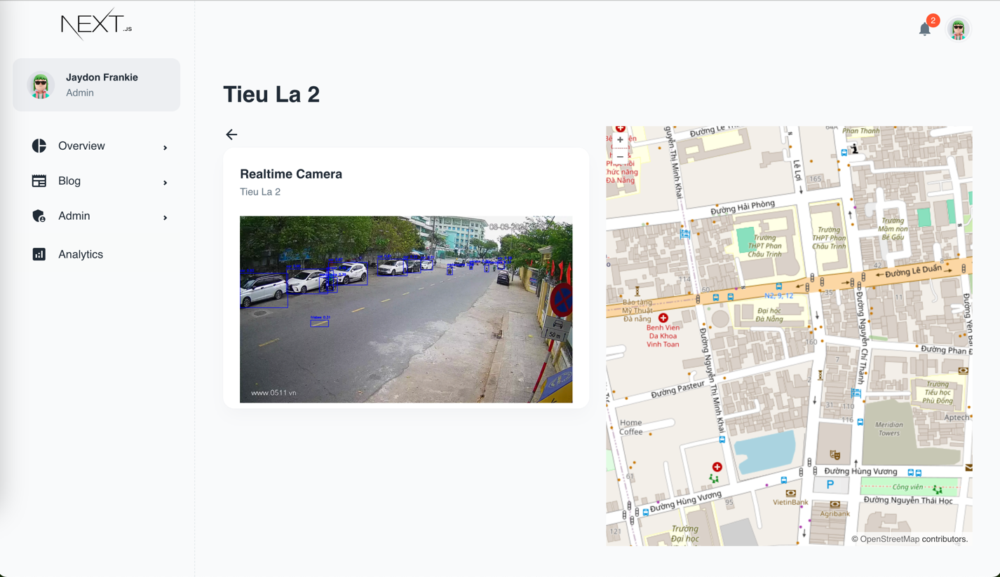
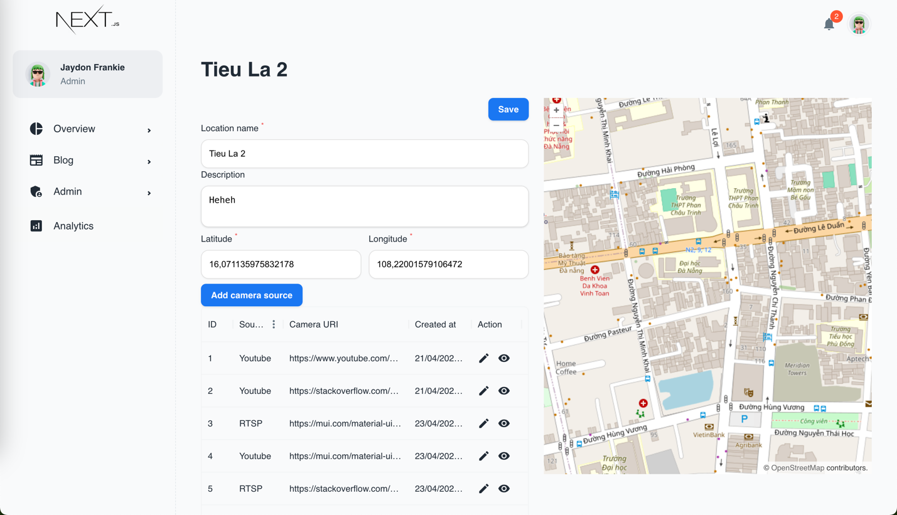

# Camera Detection Project

This project is a Python-based camera detection system that detects and analyzes objects captured by a camera feed using computer vision techniques.

## Table of Contents

- [Overview](#overview)
- [Installation](#installation)

## Overview

The Camera Detection Project is designed to analyze real-time camera feed and detect various objects using computer vision algorithms. It utilizes Python and popular computer vision libraries to process and analyze the captured video frames.

## Installation
To install and run this project locally, follow these steps:

1. Clone the repository:

   ```bash
   git clone https://github.com/minhhoangho/camera_detection.git
   ```

2. Navigate to the project directory:
   ```bash
   cd camera_detection
   ```

3. Create python environment
   ```bash
    pyenv virtualenv 3.8 camera_detection_env
    pyenv local camera_detection_env
   ```

4. Install dependencies
   ```bash
   pip install -r requirements.txt
   ```


5. Start docker to run geo server
   ```bash
   docker compose up -d
   ```


### Screenshots





### Some notes
#### SSH to EC2 instance to initiate port forwarding

```angular2html
SSH to server
ssh -i port_forwarding/ssh/remote_port_forwarding.pem  ec2-user@13.212.167.46


## check log:
cat /var/log/nginx/error.log -t

##  check port using
sudo lsof -n -i :8080
sudo netstat -tuln | grep 8080

```

```angular2html
ssh -i port_forwarding/ssh/remote_port_forwarding.pem -NR 8090:localhost:8085 ec2-user@13.212.167.46 -vvv

```

```angular2html
Check connection
access: http://13.212.167.46:8080/docs
```


